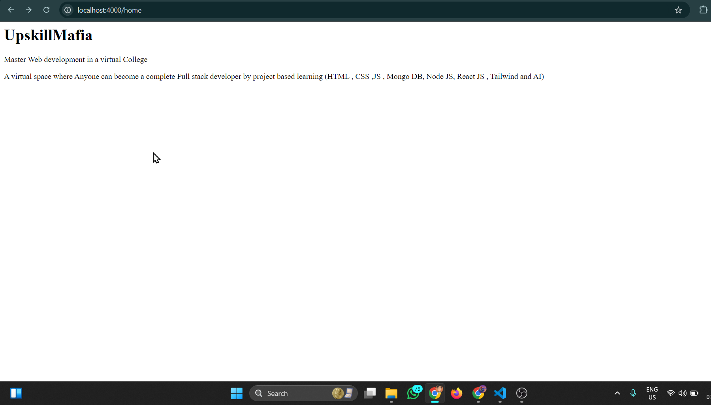
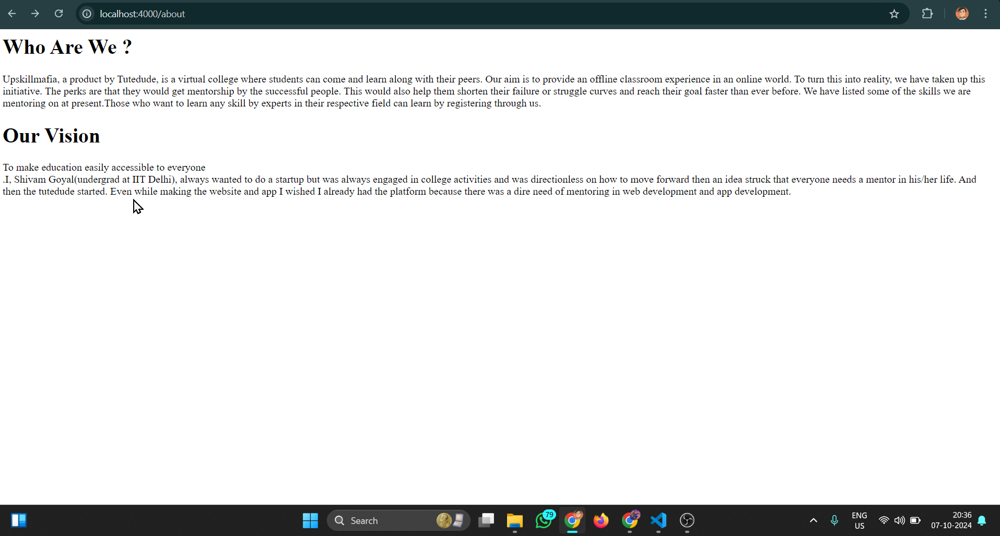

## Task 27

## Overview
This is a simple Node.js server showcasing different routes for Upskill Mafia as a task given by them for practice.

## Routes
- **Home**: `/home`
- **About**: `/about`
- **Contact**: `/contact`

- ## Demo
### Video
[](link_to_your_video)

### Images




## Getting Started
To run the server, use the following command:

```bash
node yourFile.js
